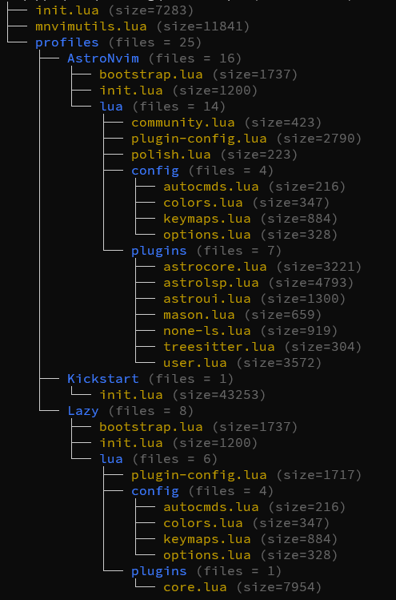
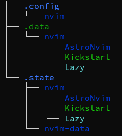

# NVIM-ProfileRouter
Allows for different nvim profiles that nest data and state within common subdirectories. Only tested on windows and has some windows specific code mainly related to paths and the batch file. A batch file will select the profile based on the env variable "NVIM_PROFILE". The batch file also allows for changing the profile using :cq 1

It includes basic profiles for AstroVim, Kickstart, and LazyVim. To use, use nvim.bat. Profiles can be changed by using :cq n where n - 10 selects the profiles listed in the batch file. e.g., :cq 11 will load the 2nd profile which is Kickstart.

The ".config\nvim" directory looks like this:

While the ".data" and ".state" look something like:

## Creating new profiles
To create a new profile requires making a profile subdirectory in .config\nvim and then copying over and modifying the init.lua and bootstrap.lua files. The bootstrap is based on the lazy boostrap code and is only needed if one wants to automate the process. It may require some work. The nvim\init.lua file simply sets up paths and routes to the profile's init.lua. It attempts to setup the paths in such a way that it pushes the profile into the nested directory substructure.

## Note
I am very new to neovim. I created this router so I could play with neovim using different profiles. The main purpose was to make it easy to back up neovim without having to deal with a bunch of different subdirectories and to have some way to change those profiles quickly.